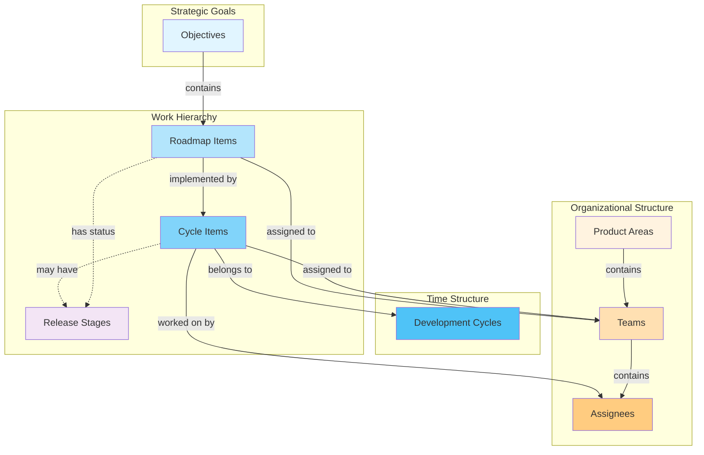

# Head North - Development Cycle Dashboard

_Head North_ is a visualisation tool or dashboard for product development organisations that work in a common cadence via high-level iterations called "development cycles" or just "cycles".

_Head North_ provides bird's eye view onto what's going on in your product development organisation, where you're putting your strategic focus and what is the progress you're making towards your north star / objectives.

_Head North_ is inspired by a similar tool, called _Omega_, that was originally envisioned and developed as internal tool at [Emarsys](https://github.com/emartech/).

## 🎯 Core Concepts

_Head North_ organizes product development around several key concepts that work together to provide comprehensive visibility into your development process. Understanding these concepts is essential for getting the most out of the tool.

### Development Cycles

**Development Cycles** are high-level iterations that represent major development phases. Each cycle typically spans several weeks and contains multiple work items. Cycles are mapped to JIRA Sprints and provide the primary timeline structure for planning and tracking progress. They serve as the fundamental time-based container for all work in _Head North_.

### Work Hierarchy: From Strategic Goals to Execution

Work in _Head North_ is organized in a hierarchical structure that connects strategic objectives to concrete execution:

#### Objectives

**Objectives** are strategic programs or themes that span multiple roadmap items and cycles. They represent larger business goals and help align individual roadmap items with broader organizational strategy. Objectives provide the "why" behind the work and connect day-to-day development to long-term vision.

#### Roadmap Items

**Roadmap Items** are customer-facing features or capabilities that represent value delivered to end users. These are the high-level items that appear on product roadmaps and are typically planned across multiple cycles. Roadmap items serve as the primary organizing principle for customer-facing work and may or may not be mapped to dedicated JIRA issue types. Each roadmap item can be linked to one or more objectives.

#### Cycle Items

**Cycle Items** are concrete work packages that implement roadmap items within a specific cycle. These usually group together one or more epics from one or more teams that work on the same topic. Cycle items are linked to their parent roadmap items and represent the granular work that moves roadmap items toward completion. Each cycle item belongs to exactly one cycle and one roadmap item. A cylce might have a Release Stage assigned if it's aiming for a customer-facing release, e.g. a piloting readiness behind a feature toggle or general availability, etc..

#### Release Stages

**Release Stages** track the current state of roadmap items in the development process (e.g., "Discovery / Shaping", "Piloting Readiness", "Sales Readiness", "General Availability", "Post-Release Refinement", etc.). Release stages provide status visibility and help track progress from conception to delivery, giving you a clear view of where each roadmap item stands in its lifecycle. Cycle Items might have a release stage assigned.

### Organizational Structure: From Product Areas to Individuals

_Head North_ also models your organizational structure to provide visibility into who is doing what:

#### Product Areas

**Product Areas** (also known as "Tribes" in e.g. the "Spotify Model") are organizational units that group together teams and related functionality or business domains (e.g., "Platform", "Mobile", "Analytics", etc.). Areas help organize work and provide visibility into how different parts of the product are progressing across cycles.

#### Teams

**Teams** map cross-functional development teams responsible for delivering work. Teams are assigned to both cycle and roadmap items and provide accountability and resource planning visibility. Team assignments help track capacity and identify bottlenecks. Each team belongs to a product area.

#### Assignees

**Assignees** are individual contributors assigned to specific cycle items. Assignee information provides granular visibility into individual workloads and helps with capacity planning and knowledge distribution. Assignees belong to teams and work on cycle items.

### Visual Overview

The following diagram illustrates how these concepts relate to each other:



## 📊 Views & Dashboards

_Head North_ provides two main views:

- **Cycle Overview**: Shows the current progress and status of completed, active, and planned cycles, containing all work packages that teams have planned into their cycles.

- **Roadmap View**: Visualizes all customer-facing roadmap items for the last completed, currently active, and next two upcoming cycles – while omitting non-customer-facing items to focus on user value delivery.

## 🏗️ Architecture & Repository Structure

_Head North_ is built as a modern web application with a clear separation between data collection, processing, and visualization. The system consists of:

1. **Web Application**: A Vue.js frontend that provides interactive dashboards for cycle visualization and roadmap planning
2. **API Service**: A Node.js/Koa backend that collects, transforms, and serves cycle data through RESTful endpoints
3. **Data Adapters**: Flexible integration layer that connects to external data sources (primarily JIRA) and transforms raw data into Head North's standardized domain model
4. **Shared Packages**: Common TypeScript types, utilities, and configuration shared across the entire application

The architecture follows a **monorepo structure** with the following organization:

```
head-north/
├── apps/
│   ├── web/           # Vue.js web application (port 8080)
│   └── api/           # Node.js/Koa API service (port 3000)
├── packages/
│   ├── types/         # Shared TypeScript types and interfaces
│   ├── utils/         # Shared utility functions (logging)
│   ├── config/        # Shared configuration files
│   └── jira-primitives/ # JIRA data transformation utilities
├── tools/
│   ├── eslint-config/ # Shared ESLint configuration
│   ├── prettier-config/ # Shared Prettier configuration
│   ├── typescript-config/ # Shared TypeScript configuration
│   ├── test-config/ # Shared test configuration
│   └── build-config/ # Shared build configuration
├── scripts/
│   └── validate-env.js # Environment validation script
├── package.json       # Root package.json with workspace configuration
└── README.md          # This file
```

## 🔌 Data Source Adapter Architecture

Head North's default data source is **JIRA** with a specific model that maps Head North's internal domain model 1:1 to JIRA concepts:

- **Roadmap Items** → JIRA issue type "Roadmap Item"
- **Cycle Items** → JIRA issue type "Cycle Item"
- **Cycles** → JIRA Sprints
- **Metadata** (areas, teams, objectives, release stages, etc.) → Fields within these issue types

This direct mapping allows for straightforward data transformation and ensures consistency between your JIRA setup and Head North's visualization.

### Customization Options

You have two main approaches:

1. **Use the Default Adapter**: Model your JIRA setup to fit Head North's expected structure (separate issue types, label-based metadata, etc.)

2. **Create a Custom Adapter**: If you already have a different JIRA setup or prefer a different structure, you can create your own data adapter. The `@headnorth/jira-primitives` package provides reusable utilities for JIRA data transformation, validation, and API interaction to simplify this process.

For detailed information about creating custom adapters, see the [JIRA Adapters documentation](apps/api/src/adapters/README.md).

## 🚀 Quick Start

### Prerequisites

- Node.js 22.x LTS
- npm 10.x

### Fastest way to run

```bash
# Start API backend with fake data (no Jira required)
# as well as the web frontend at the same time!
HN_DATA_SOURCE_ADAPTER=fake npm run dev
```

### Use the Prewave Jira adapter

```bash
# Start API with Prewave adapter (requires Jira env vars)
cd apps/api
HN_DATA_SOURCE_ADAPTER=prewave npm run start-dev
```

See `env.example` for required Jira variables. For detailed developer commands and workflows, see [docs/development.md](docs/development.md).

## 📚 Documentation

- Development Guide: [docs/development.md](docs/development.md)
  - Purpose: How to run locally (fake and Jira adapters), environment setup, scripts, tooling, and day-to-day workflows.
- Deployment Guide: [docs/deployment.md](docs/deployment.md)
  - Purpose: How to build and deploy (Docker, static frontend, cloud/local manifests).
- Architecture: [docs/architecture.md](docs/architecture.md)
  - Purpose: Deep overview of the system, monorepo layout, domain concepts, shared configuration (single source of truth).
- JIRA Adapters: [apps/api/src/adapters/README.md](apps/api/src/adapters/README.md)
  - Purpose: Available adapters (default, prewave, fake), how selection works, when to build custom adapters.
- Package References:
  - Config: [packages/config/README.md](packages/config/README.md) – endpoints, routes, validation dictionaries, usage.
  - Jira primitives: [packages/jira-primitives/README.md](packages/jira-primitives/README.md) – extractors, transformers, validators, Jira client.

## 🤝 Contributing

- Start here: [CONTRIBUTING.md](CONTRIBUTING.md) – contribution process, branching/PR flow, checklists.
- Code style and practices: [docs/CODING_GUIDELINES.md](docs/CODING_GUIDELINES.md) – FP patterns (Maybe/Either), TypeScript best practices, testing, migration patterns, quick reference.

---

## 📄 License

This project is licensed under the MIT License - see the [LICENSE](LICENSE) file for details.

Copyright (c) 2025 Michael Wagner-Kulovits
Developed while employed at Prewave
